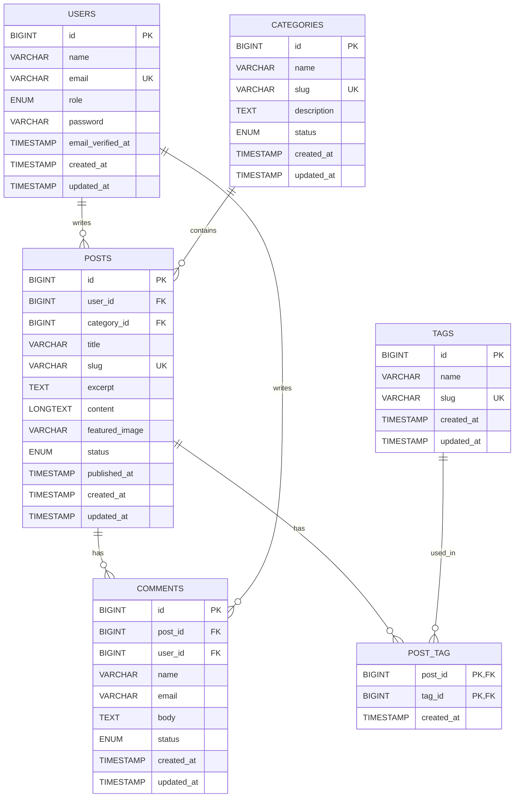

# Tugas ERD - Sistem Blog / Content Management Laravel Filament

## Deskripsi ERD

ERD ini dibuat untuk sistem Blog / Content Management yang terhubung secara konsep dengan project Laravel Filament. Project utama menggunakan database `filament_app`, sedangkan tugas ERD ini menggunakan database terpisah bernama `erd_filament_blog` agar tidak mengganggu database Laravel yang sudah berjalan.

Sistem ini menggambarkan pengelolaan artikel blog, kategori, tag, dan komentar. Admin atau user dapat menulis banyak post, setiap post berada dalam satu kategori, post dapat memiliki banyak tag, dan post dapat menerima banyak komentar dari user.

## Daftar Tabel

1. `users`
   - Menyimpan data pengguna atau penulis.
   - Satu user dapat membuat banyak post.
   - Satu user dapat membuat banyak komentar.

2. `categories`
   - Menyimpan kategori post.
   - Satu kategori dapat digunakan oleh banyak post.

3. `posts`
   - Menyimpan artikel blog.
   - Setiap post dimiliki oleh satu user sebagai author.
   - Setiap post dapat memiliki satu kategori.
   - Setiap post dapat memiliki banyak tag melalui tabel `post_tag`.
   - Setiap post dapat memiliki banyak komentar.

4. `tags`
   - Menyimpan label atau tag untuk post.
   - Satu tag dapat digunakan oleh banyak post.

5. `post_tag`
   - Tabel pivot untuk relasi many-to-many antara `posts` dan `tags`.
   - Satu post bisa memiliki banyak tag.
   - Satu tag bisa digunakan oleh banyak post.

6. `comments`
   - Menyimpan komentar pada post.
   - Setiap komentar dimiliki oleh satu post.
   - Setiap komentar dapat dibuat oleh satu user.

## Relasi Antar Tabel

| Relasi | Jenis Relasi | Keterangan |
| --- | --- | --- |
| `users` ke `posts` | One-to-Many | Satu user dapat menulis banyak post. |
| `categories` ke `posts` | One-to-Many | Satu kategori dapat memiliki banyak post. |
| `posts` ke `tags` | Many-to-Many | Satu post dapat memiliki banyak tag dan satu tag dapat dipakai banyak post melalui `post_tag`. |
| `posts` ke `comments` | One-to-Many | Satu post dapat memiliki banyak komentar. |
| `users` ke `comments` | One-to-Many | Satu user dapat menulis banyak komentar. |

## Mermaid ERD

## Keterangan Screenshot ERD

Screenshot ERD diambil dari DBeaver setelah database `erd_filament_blog` dibuat dan semua query DDL berhasil dijalankan. Screenshot harus memperlihatkan keenam tabel, yaitu `users`, `categories`, `posts`, `tags`, `post_tag`, dan `comments`, beserta garis relasi foreign key antar tabel.

Pastikan relasi berikut terlihat pada ERD DBeaver:

- `posts.user_id` terhubung ke `users.id`
- `posts.category_id` terhubung ke `categories.id`
- `post_tag.post_id` terhubung ke `posts.id`
- `post_tag.tag_id` terhubung ke `tags.id`
- `comments.post_id` terhubung ke `posts.id`
- `comments.user_id` terhubung ke `users.id`
